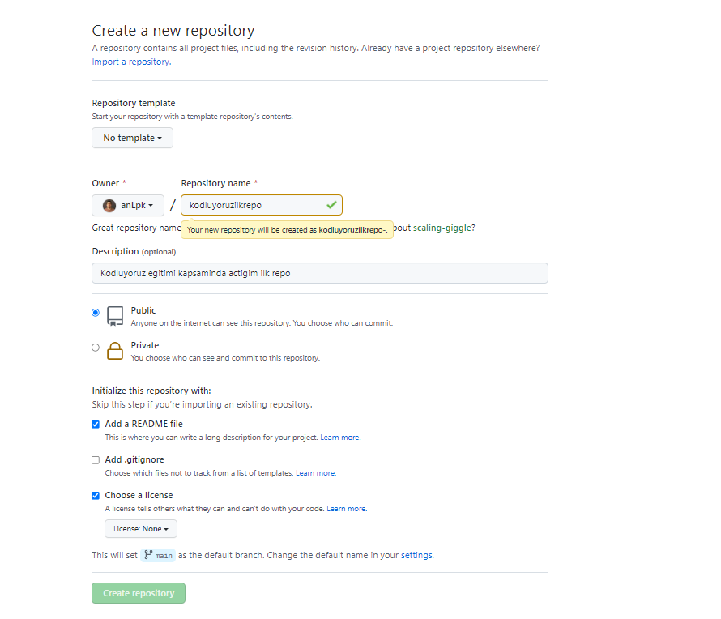

# Kodluyoruz Ilk Repo
Bu repo [Kodluyoruz](https://www.kodluyoruz.org/) Front-End Egitiminde olusturdugumuz ilk repo. Icersinde bir adet README dosyasi, bir adet de index.html barindiriyor.



## Installation
---
Öncelikle projeyi clonelayın. (Buraya sizin reponuzdan aldığınız link gelecek)

```
git clone https://github.com/anLpk/kodluyoruzilkrepo.git
```

## Usage
---
Projeyi cloneladıktan sonra Visual Studio Code programında açınız.
Linux için:
```
cd kodluyoruzilkrepo
code .
```

## Contributing
---
Pull requestler kabul edilir. Büyük değişiklikler için, lütfen önce neyi değiştirmek istediğinizi tartışmak için bir konu açınız.

## Licence
---
[MIT](https://choosealicense.com/licenses/mit/)